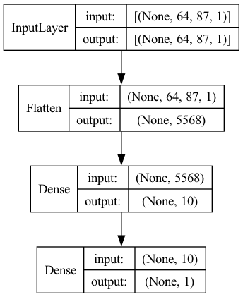

# Advancing Pneumonia Diagnosis Through Neural Networks
***
**Author:** Ron Lodetti Jr.

Image by [Freepik](https://www.freepik.com/free-photo/doctor-checking-radiography-front-view_35436186.htm#fromView=search&page=1&position=0&uuid=0c377c4a-a764-4319-8c20-d708851a483)

## Overview
***
In this project, I developed a machine learning model to enhance the diagnosis of pneumonia in pediatric patients using 5,863 high-quality, expert-diagnosed chest X-ray images from the Guangzhou Women and Children’s Medical Center. Data preparation involved reorganizing the dataset into an 80-10-10 split for training, validation, and test sets, maintaining consistent positive/negative ratios. Images were downsampled during import to balance computational efficiency with image quality, cropped to a uniform aspect ratio of 1.37 to prioritize central content, and rescaled for normalization, ensuring reliable model training and evaluation.

Utilizing TensorFlow and Keras, my modeling process involved iterative training and evaluation, focusing on optimizing loss, recall, and AUC metrics for accurate pneumonia detection. I began with simpler models, progressively incorporating more complex configurations, including Conv2D layers and increased nodes. To prevent overfitting, I experimented with dropout layers, L1/L2 regularization, and data augmentation. I also tested various initializers and optimizers to enhance model efficiency. Furthermore, I applied transfer learning with the pretrained ResNet50 model to improve results.

The final model demonstrated an exceptional ability to identify pneumonia, achieving a recall of 97.2% and an AUC of 99.11% on unseen test data. These results highlight its potential for accurately diagnosing pneumonia and suggest strong generalizability to new data. This project underscores the significant promise of machine learning in improving pediatric pneumonia diagnosis, offering a pathway towards more efficient and accurate healthcare solutions. 

## Business Problem
***
Pneumonia, a significant respiratory condition that affects millions globally, presents a diagnostic challenge as much time and resources are spent manually interpreting chest x-rays by radiologists. 

I have been tasked by a children's hospital to develop a model that can classify whether a given patient has pneumonia, given a chest x-ray image. If successful, this could significantly improve diagnosis accuracy and efficiency, ultimately providing better care for patients.

## Data Understanding
The dataset originally comes from Kermany et al. on [Mendeley](https://data.mendeley.com/datasets/rscbjbr9sj/3). I downloaded the data from [Kaggle](https://www.kaggle.com/datasets/paultimothymooney/chest-xray-pneumonia) as it had already separated out the chest x-ray images from other data in the original dataset.

The following description is taken directly from [Kaggle](https://www.kaggle.com/datasets/paultimothymooney/chest-xray-pneumonia):
>The dataset is organized into 3 folders (train, test, val) and contains subfolders for each image category (Pneumonia/Normal). There are 5,863 X-Ray images (JPEG) and 2 categories (Pneumonia/Normal).
>
>Chest X-ray images (anterior-posterior) were selected from retrospective cohorts of pediatric patients of one to five years old from Guangzhou Women and Children’s Medical Center, Guangzhou. All chest X-ray imaging was performed as part of patients’ routine clinical care.
>
>For the analysis of chest x-ray images, all chest radiographs were initially screened for quality control by removing all low quality or unreadable scans. The diagnoses for the images were then graded by two expert physicians before being cleared for training the AI system. In order to account for any grading errors, the evaluation set was also checked by a third expert.

Kermany D, Goldbaum M, Cai W et al. Identifying Medical Diagnoses and Treatable Diseases by Image-Based Deep Learning. Cell. 2018; 172(5):1122-1131. doi:10.1016/j.cell.2018.02.010.

## Data Preparation
***
To prepare my data for modeling I:
- Reorganized the image files.
- Imported my training data, standardizing aspect ratio.
- Applied scaling to the training data for normalization.
- Imported validation data to be used test the model's performance.
- Created a specialized dataset specifically formatted for use with the ResNet50 classifier.

### Reorganized the image files.
I redistributed the data, giving an 80-10-10 train-validation-test split. 

I also made sure to keep the positive/negative ratio the same for each dataset. 

## Data Modeling
***
During the modeling process, I iteratively trained and evaluated numerous models to identify the most effective one. A validation dataset, previously unseen by the model, was used for evaluation to ensure accuracy in real-world scenarios. To inform my decision-making, I relied on both loss and recall metrics, aiming to minimize error while maximizing the model's ability to correctly identify pneumonia cases. I also included the Area Under the ROC Curve (AUC) to provide insight into the model's overall performance, ensuring it doesn't just achieve high recall by simply labeling all cases as positive.

Key adjustments made during model iterations and hyperparameter tuning included:

- Adjusting the number and configuration of layers and nodes.
- Choosing between Dense and Conv2D layers for structure.
- Implementing regularization techniques such as Dropout layers, L1/L2 regularization, and data augmentation to prevent overfitting.
- Selecting appropriate initializers and optimizers for optimization.
- Applying transfer learning with the pretrained ResNet50 model to leverage pre-existing neural network architectures.

### Baseline Model
For my baseline model I decided to use a simple neural network with no hidden layers. 

### Initializers
After my simple baseline model I decided to experiment with different initializers to help my model start off from a better position, which can lead to faster convergence and potentially better overall performance.
- He normal
- LeCun normal
- No Initializer

### Building Complex Model
I opted to enhance the complexity of my model by increasing the number of layers and nodes, aiming to capture any underlying patterns, despite the potential risk of overfitting.

The process started with adding more nodes and dense layers. I then constructed a Convolutional Neural Network (CNN), incrementally introducing more layers and nodes until achieving a sufficiently complex model where signs of overfitting became evident.

### Optimizers
After adding complexity to my model, I started exploring different optimizers to assess their impact on the model's learning efficiency and speed. At this stage, I implemented early stopping to halt training when no significant improvement in validation loss is observed.
- SGD, Gradient descent (with momentum) optimizer
- RMSprop
- Adam

### Regularization
Since I have a model that is overfitting, I applied regularization methods to help in making the model less sensitive to the specific details of the training data, encouraging it to learn more generalized patterns that apply to unseen data as well. 

Methods included:
- dropout layers,
- L1/L2 regularization, and
- data augmentation

### Transfer Learning with Resnet
Before finalizing my model selection, I explored transfer learning using the pretrained ResNet50 model.

### Final model
In the end, the Dropout model performed the best. 

## Evaluation
***
The final model significantly outperforms all other models, achieving superior scores across all metrics in the testing set. Ultimately, it accurately identified 97% of pneumonia images.

Given the scoring on validation and testing datasets, I'm confident these results would generalize to new, unseen data. 

|           name | Test Loss | Test Recall | Test AUC |
|---------------:|----------:|------------:|---------:|
| Baseline Model |    0.2914 |      0.8388 |   0.9449 |
|  Overfit Model |    0.3313 |      0.9579 |   0.9666 |
|   Resnet Model |    0.3291 |      0.9299 |   0.9327 |
|    Final Model |    0.1089 |      0.9720 |   0.9911 |

### Final Model Confusion Matrix

## Conclusions

### Recommendations
Based on the final model, it is recommended that the children's hospital consider incorporating this model into their pneumonia diagnosis workflow. Initially, radiologists and the model should independently evaluate chest X-rays, with their diagnoses being compared to assess the model's reliability and accuracy. Over time, as confidence in the model's diagnostic capabilities grows, the hospital could gradually shift more responsibility to the model. This approach aims to not only enhance diagnostic efficiency but also improve accuracy, ultimately benefiting patient care.

### Limitations
- Although a 97% accuracy rate is impressive, it implies that 3% of patients with the condition are misdiagnosed as healthy.
- Given that the images in this dataset underwent initial quality control, removing low-quality and unreadable scans, the model is likely most effective with high-quality images.
  
### Next Steps
- Encourage increased use of chest X-ray imaging, as the cost to diagnose images has decreased.
- Continuously update the training sets with new images to refine and improve model accuracy.
- Instead of a binary classifier, future models could be made to detect bacterial vs viral pneumonia cases. 

## For More Information

See the full analysis in the [Jupyter Notebook](./image_classification_project.ipynb) or review this [presentation](./image_classification_project_presentation.pdf).

For additional info, contact Ron Lodetti at [ron.lodetti@gmail.com](mailto:ron.lodetti@gmail.com)

## Repository Structure
├── src
│   ├── __init__.py
│   ├── data_understanding.py
│   ├── data_prep.py
│   └── data_modeling.py
├── data
│   ├── new_test
│   │   ├── NORMAL
│   │   └── PNEUMONIA
│   ├── new_train
│   │   ├── NORMAL
│   │   └── PNEUMONIA
│   └── new_val
│       ├── NORMAL
│       └── PNEUMONIA
├── images
├── README.md
├── requirements.txt
├── image_classification_project_presentation.pdf
└── image_classification_project.ipynb
